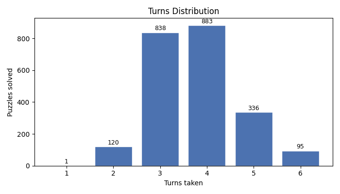

# Wordle Solver Report — Mode A (Investigation + Hail Mary)

Evaluated against 2315 official Wordle puzzles.

---

## Summary

| Metric | Value |
|---|---|
| Total puzzles | 2315 |
| Solved | 2273 |
| Failed | 42 |
| Solve rate | 98.2% |
| Average turns (solved) | 3.76 |
| Median turns (solved) | 4.0 |
| 90th-percentile turns | 5.0 |

## Solve Rate

Mode A uses discovery guesses for the first 3 turns to expose as many letters as possible, then switches to the strongest surviving candidate.

## Turns Distribution

Each bar shows how many puzzles were solved in that many turns. Puzzles not solved within 6 turns are counted as failures.

## Failures (42 puzzles)

| Secret | Guesses tried |
|---|---|
| `crazy` | alert → acorn → chair → crack → cramp → crass |
| `gazer` | alert → baker → caper → eager → gamer → gayer |
| `grave` | alert → baker → crane → drape → erase → frame |
| `graze` | alert → baker → crane → drape → erase → frame |
| `grope` | alert → rouse → broke → crone → drove → froze |
| `holly` | alert → lousy → coyly → dolly → folly → golly |
| `homer` | alert → rouse → boxer → corer → foyer → goner |
| `hover` | alert → rouse → boxer → corer → foyer → goner |
| `joker` | alert → rouse → boxer → corer → foyer → goner |
| `jolly` | alert → lousy → coyly → dolly → folly → golly |

