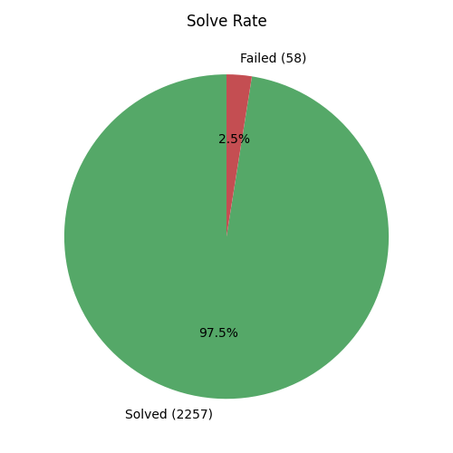
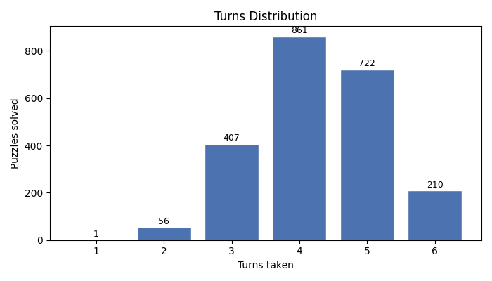

# Wordle Solver Report — Mode B (Hail Mary Only)

Evaluated against 2315 official Wordle puzzles.

---

## Summary

| Metric | Value |
|---|---|
| Total puzzles | 2315 |
| Solved | 2257 |
| Failed | 58 |
| Solve rate | 97.5% |
| Average turns (solved) | 4.27 |
| Median turns (solved) | 4.0 |
| 90th-percentile turns | 5.0 |

## Solve Rate

Mode B skips discovery entirely. Every guess is the highest-ranked surviving candidate from turn 1, a pure hail-mary strategy.

## Turns Distribution

Each bar shows how many puzzles were solved in that many turns. Puzzles not solved within 6 turns are counted as failures.

## Failures (58 puzzles)

| Secret | Guesses tried |
|---|---|
| `bunny` | aback → beefy → biddy → bobby → buggy → bully |
| `burly` | aback → beefy → biddy → bobby → buggy → bully |
| `bushy` | aback → beefy → biddy → bobby → buggy → bully |
| `chart` | aback → cease → chaff → chain → champ → chard |
| `craze` | aback → cease → chafe → crane → crate → crave |
| `crowd` | aback → cello → choir → crony → cross → croup |
| `drown` | aback → defer → dirty → droll → droop → dross |
| `graze` | aback → dealt → erase → frame → grape → grave |
| `grout` | aback → defer → girly → groom → gross → group |
| `grown` | aback → defer → girly → groom → gross → group |

