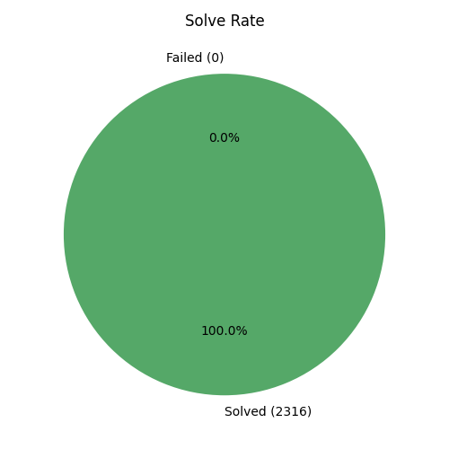
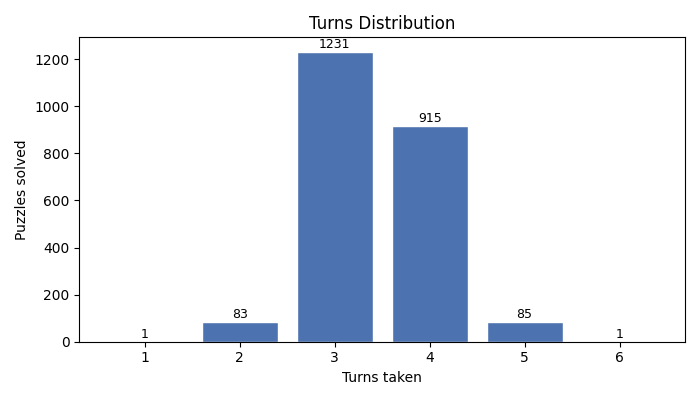

# Wordle Solver Report Mode C (Hail-Mary Only)

Tested on 2316 official Wordle answers.

---

## Summary

| Metric | Value |
|---|---|
| Total puzzles | 2316 |
| Solved | 2316 |
| Failed | 0 |
| Solve rate | 100.0% |
| Average turns (solved) | 3.43 |
| Median turns (solved) | 3.0 |
| 90th percentile turns | 4.0 |

## Solve Rate

Mode B commits immediately. Every guess is the best candidate. No discovery, no hesitation.

## Turns Distribution

Each bar shows how many puzzles were solved in that many turns. Anything beyond turn 6 is a failure.

